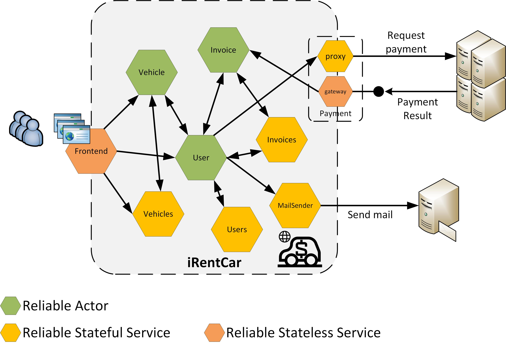

# iRentCar
iRentCar is a simple implementation of a rent car platform based on Service Fabric.

The following image describes the architectural view:

## Platform Components
iRentCar consists of several microservices described in the following sections.

### VehicleActor
It is a Reliable Actor who has the responsibility to manage the status of a single vehicle. It stores all the vehicle data, its state (Available, NotAvailable and Busy) and the data of the user rents the vehicle.

### UserActor
It is a Reliable Actor who has the responsibility to manage the status of a user registered in the platform. It stores all the user data, the current rent data and all the invoices that the user had.

### InvoiceActor
It is a Reliable Actor who has the responsibility to manage a single invoice for the platform. It stores the invoice's data and its state.

### VehiclesService
It is a Reliable Stateful Service that exposes search features over the vehicles of the platform. VehicleActor uses this service to check if it is a valid vehicle or not and interacts with it to update its status.

### UsersService
It is a Reliable Stateful Service that exposes search features over the users of the platform. UserActor uses this service to check if it is a valid user or not.

### InvoicesService
It is a Reliable Stateful Service who has the responsibility to manage the invoice numeration and generate the invoice actor instances in the right way. The UserActor uses this service when it has to create a new invoice in the release vehicle scenario. 

### MailSender
It is a Reliable Stateful Service that allows sending emails.

### FrontEnd
It is a Reliable Stateless Service that hosts the web application used to manage the platform.

### PaymentService
This component consists of two microservices: PaymentProxy and PaymentGateway.

#### PaymentProxy
It is a Reliable Stateful Service used by the platform to send a payment request to the external payment system.

#### PaymentGateway
It is a Reliable Stateless Service that hosts the web API application that exposes the WebHook for the payment confirmation.
